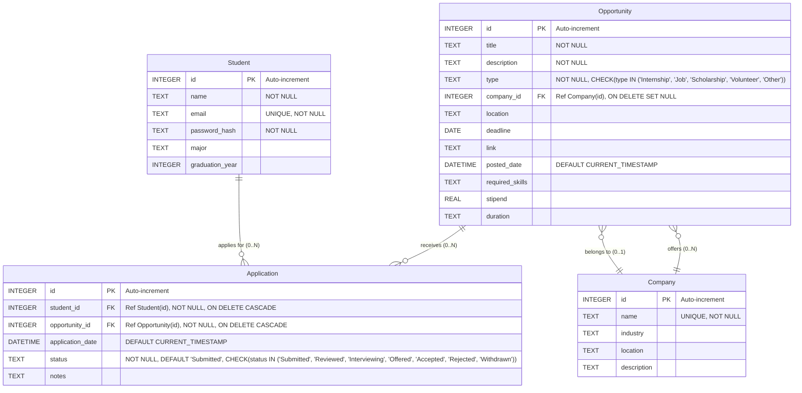

# Entity Relationship Diagram (ERD)

This diagram visualizes the relationships between the database tables defined in `db/db.js`.

**Key:**

*   `PK`: Primary Key
*   `FK`: Foreign Key
*   `UK`: Unique Key
*   `||--o{`: One-to-Many relationship (one side mandatory, many side optional/zero or more)
*   `}o--||`: Many-to-One relationship (many side optional/zero or one, one side mandatory)
*   `(0..N)`: Cardinality (Zero to Many)
*   `(0..1)`: Cardinality (Zero to One)
